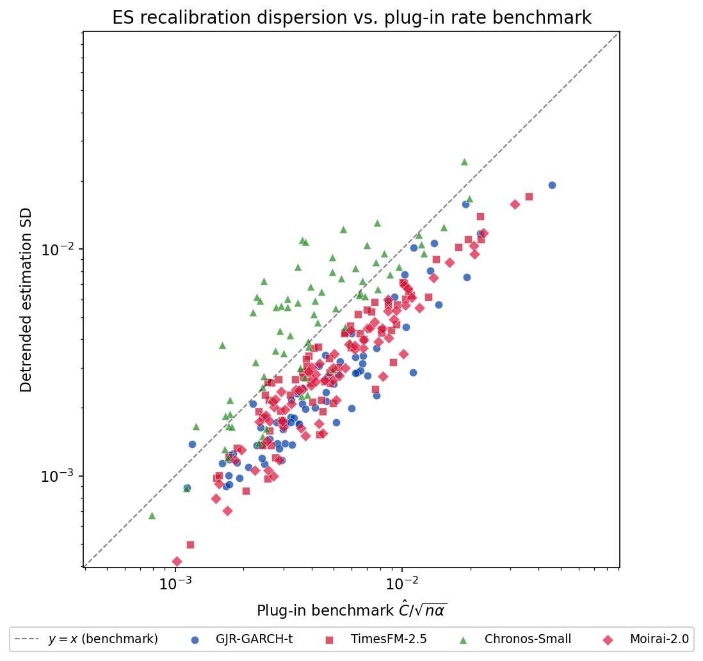
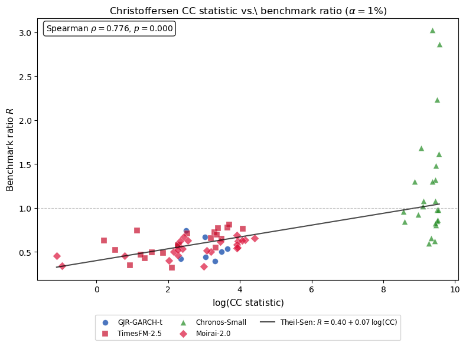
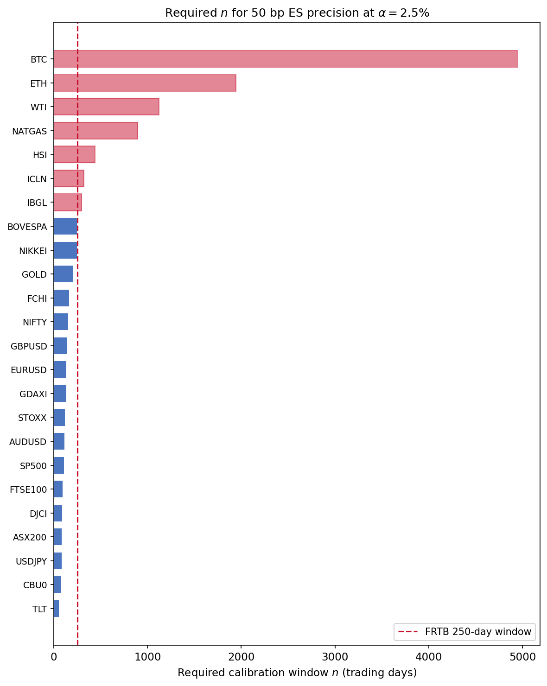
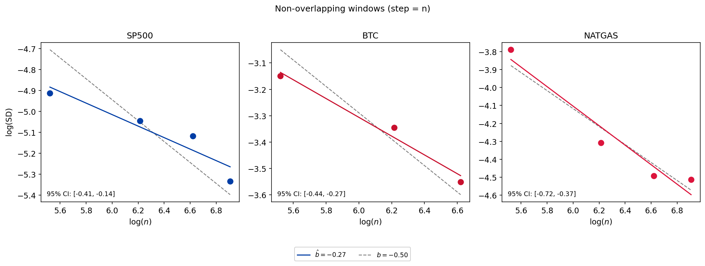

# HMD_ES

## Finite-Sample Precision Limits for Expected Shortfall Forecast Comparisons

**Authors:** Daniel Traian Pele and Miruna Mazurencu-Marinescu-Pele (Bucharest University of Economic Studies)

### Overview

Replication code and data for *"Finite-Sample Precision Limits for Expected Shortfall Forecast Comparisons"*.

The paper converts the known $(n\alpha)^{-1/2}$ information limit for Expected Shortfall estimation into an operational precision-audit framework for pairwise ES forecast comparison.

### Results

**Detrended SD vs. plug-in precision benchmark** — each point is one (asset, forecaster, α) cell; the dashed line marks R = 1.



**VaR-first diagnostic** — Christoffersen conditional-coverage statistic vs. benchmark ratio R at α = 1%. Excess dispersion concentrates in poorly VaR-calibrated cells.



**Required calibration window for 50 bp ES precision** — the vertical line marks the 250-day default.



**Window-length scaling** — non-overlapping windows confirm the $(n\alpha)^{-1/2}$ rate.



### Repository Structure

```
code/           Python analysis scripts
  pipeline.py           Main rolling-window FZ recalibration pipeline
  regen_all_figures.py  Regenerate all figures and tables
  figures.py            Figure generation routines
  v_next/               Robustness and diagnostic scripts
data/           Processed CSV results
  recalib_results.csv   Rolling recalibration results (24 assets × 4 forecasters × 3 alpha)
  rolling_estimates.csv Rolling-window ES correction estimates
tables/         Generated LaTeX tables
figures/        Generated PDF/PNG plots
```

### Requirements

Python 3 with: `numpy`, `pandas`, `scipy`, `matplotlib`

### Usage

```bash
python code/pipeline.py            # Main analysis pipeline
python code/regen_all_figures.py   # Regenerate all figures and tables
```

### Data

Daily return data are sourced from Yahoo Finance for 24 global assets (equities, bonds, commodities, cryptocurrencies, FX). Forecasters: GJR-GARCH-t, TimesFM 2.5, Chronos-Small, Moirai 2.0.

### Citation

Pele, D. T. & Mazurencu-Marinescu-Pele, M. (2026). Finite-Sample Precision Limits for Expected Shortfall Forecast Comparisons. *Mathematics* (submitted).

### Funding

This project has received funding from the Marie Skłodowska-Curie Actions under the European Union's Horizon Europe research and innovation program for the Industrial Doctoral Network on Digital Finance, acronym DIGITAL, Project No. 101119635; the project "IDA Institute of Digital Assets", CF166/15.11.2022, contract number CN760046/23.05.2023; the project "AI for Energy Finance (AI4EFin)", CF162/15.11.2022, contract number CN760048/23.05.2023; the project "Accountable Governance and Responsible Innovation in Artificial Intelligence", CF158/15.11.2022, contract number CN760047/23.05.2023, financed under Romania's National Recovery and Resilience Plan, Apel nr. PNRR-III-C9-2022-I8.

We acknowledge the support of the project "MA'AT — Autonomous Model for Textual Assistance", SMIS Code 2021+: 330941, funding contract no. 390090/11.11.2025, project co-financed by the European Regional Development Fund through the Smart Growth, Digitalisation and Financial Instruments Programme 2021–2027 (POCIDIF).
